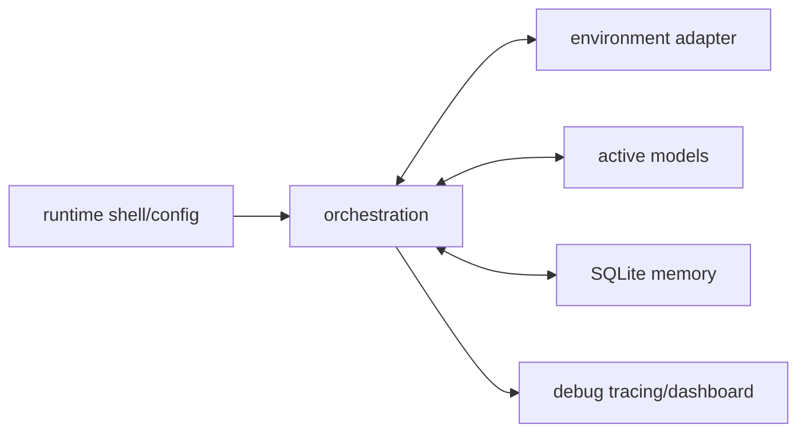
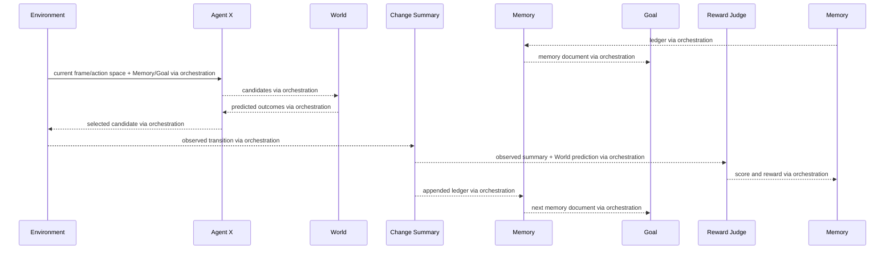

# Software Diagrams

```mermaid
flowchart LR
    Runtime["runtime shell/config"]
    Orch["orchestration"]
    Env["environment adapter"]
    Models["active models"]
    Memory["SQLite memory"]
    Debug["debug tracing/dashboard"]

    Runtime --> Orch
    Orch <--> Env
    Orch <--> Models
    Orch <--> Memory
    Orch --> Debug
```

```mermaid
sequenceDiagram
    participant Env as Environment
    participant X as Agent X
    participant W as World
    participant C as Change Summary
    participant MemRole as Memory
    participant G as Goal
    participant J as Reward Judge
    participant M as Memory
    M-->>MemRole: ledger via orchestration
    MemRole-->>G: memory document via orchestration
    Env->>X: current frame/action space + Memory/Goal via orchestration
    X-->>W: candidates via orchestration
    W-->>X: predicted outcomes via orchestration
    X-->>Env: selected candidate via orchestration
    Env-->>C: observed transition via orchestration
    C-->>J: observed summary + World prediction via orchestration
    J-->>M: score and reward via orchestration
    C-->>MemRole: appended ledger via orchestration
    MemRole-->>G: next memory document via orchestration
```
