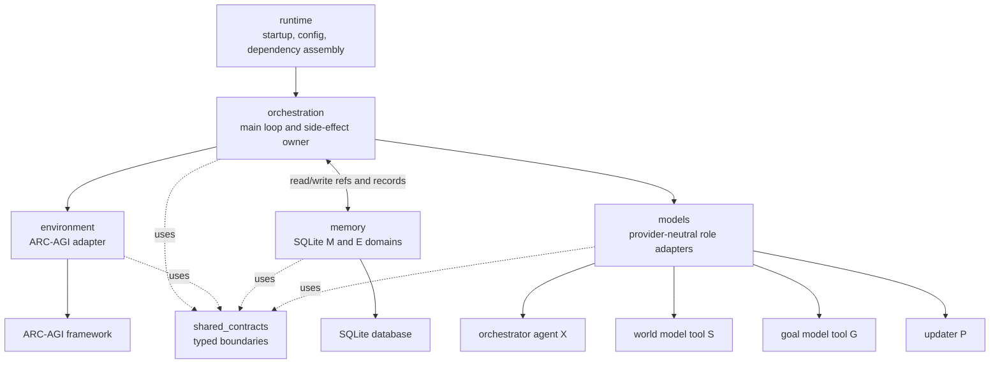
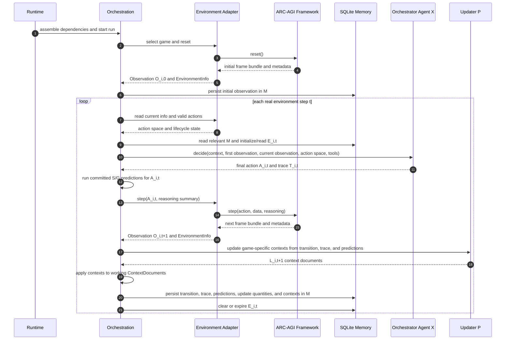

# Software Architecture Diagrams

These diagrams describe the target architecture. They intentionally show
orchestration as the central owner of execution, persistence, model routing,
and environment communication.

## High-Level Block Diagram

## Main Execution Loop

## Agent-As-Tools Flow

```mermaid
sequenceDiagram
    autonumber
    participant Orch as Orchestration
    participant X as Orchestrator Agent X
    participant Router as Tool Routing
    participant S as World Tool Agent S
    participant G as Goal Tool Agent G
    participant E as Experimental Memory E
    participant M as Persistent Memory M

    Orch->>X: decision request with callable world and goal tools
    X->>Orch: request world tool call(action, source_ref)
    Orch->>M: resolve exact persisted state frame when needed
    Orch->>E: resolve exact persisted prediction when needed
    Orch->>Router: route world call
    Router->>S: predict(C^S, action, resolved observation)
    S-->>Router: ToolResult O_hat^S
    Router-->>Orch: world tool result
    Orch->>E: persist temporary world result and ref id
    Orch-->>X: return world result and ref id in active context

    X->>Orch: request goal tool call(prior_prediction_ref)
    Orch->>E: resolve exact persisted world prediction
    Orch->>Router: route goal call
    Router->>G: predict(C^G, resolved observation)
    G-->>Router: ToolResult O_hat^G
    Router-->>Orch: goal tool result
    Orch->>E: persist temporary goal result and ref id
    Orch-->>X: return goal result and ref id in active context

    X-->>Orch: final action and full trace
    Orch->>M: commit selected action, trace, and selected tool artifacts
```

