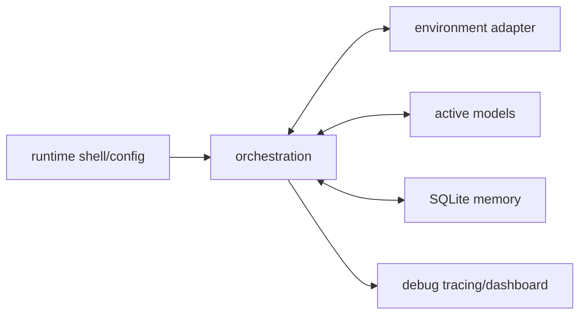
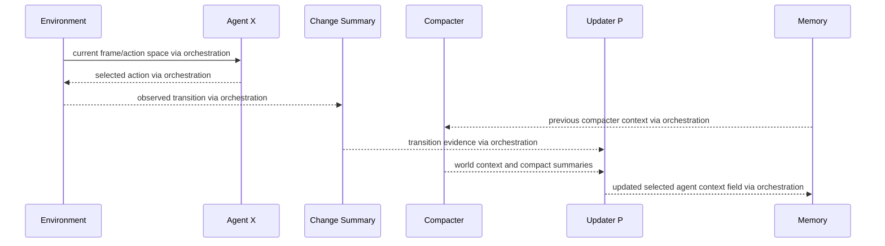

# Software Diagrams

```mermaid
flowchart LR
    Runtime["runtime shell/config"]
    Orch["orchestration"]
    Env["environment adapter"]
    Models["active models"]
    Memory["SQLite memory"]
    Debug["debug tracing/dashboard"]

    Runtime --> Orch
    Orch <--> Env
    Orch <--> Models
    Orch <--> Memory
    Orch --> Debug
```

```mermaid
sequenceDiagram
    participant Env as Environment
    participant X as Agent X
    participant C as Change Summary
    participant K as Compacter
    participant P as Updater P
    participant M as Memory
    Env->>X: current frame/action space via orchestration
    X-->>Env: selected action via orchestration
    Env-->>C: observed transition via orchestration
    M-->>K: previous compacter context via orchestration
    C-->>P: transition evidence via orchestration
    K-->>P: world context and compact summaries
    P-->>M: updated selected agent context field via orchestration
```
