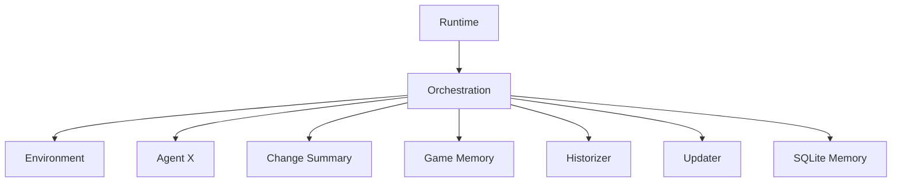
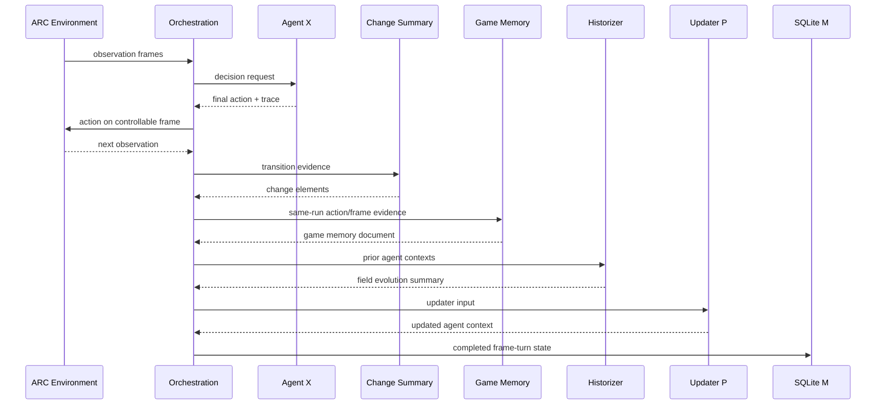

# Software Diagrams

```mermaid
flowchart TD
    Runtime --> Orchestration
    Orchestration --> Environment
    Orchestration --> AgentX["Agent X"]
    Orchestration --> Change["Change Summary"]
    Orchestration --> MemoryRole["Game Memory"]
    Orchestration --> Historizer
    Orchestration --> Updater
    Orchestration --> SQLite["SQLite Memory"]
```

```mermaid
sequenceDiagram
    participant Env as ARC Environment
    participant Orch as Orchestration
    participant X as Agent X
    participant C as Change Summary
    participant M as Game Memory
    participant H as Historizer
    participant P as Updater P
    participant DB as SQLite M

    Env->>Orch: observation frames
    Orch->>X: decision request
    X-->>Orch: final action + trace
    Orch->>Env: action on controllable frame
    Env-->>Orch: next observation
    Orch->>C: transition evidence
    C-->>Orch: change elements
    Orch->>M: same-run action/frame evidence
    M-->>Orch: game memory document
    Orch->>H: prior agent contexts
    H-->>Orch: field evolution summary
    Orch->>P: updater input
    P-->>Orch: updated agent context
    Orch->>DB: completed frame-turn state
```
