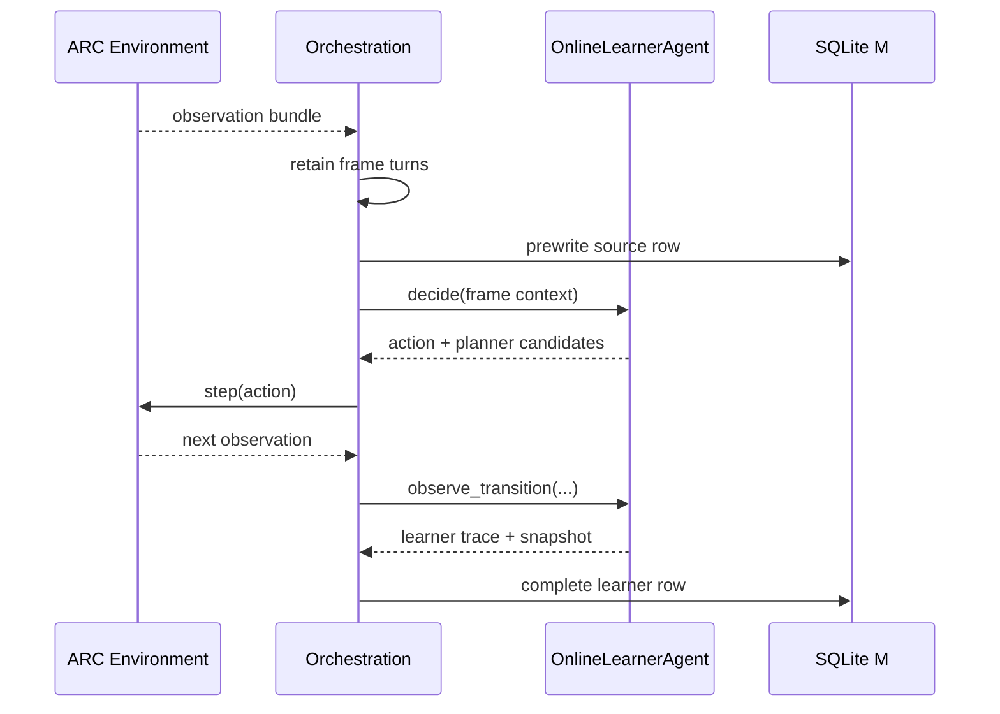

# Software Diagrams

```mermaid
sequenceDiagram
    participant Env as ARC Environment
    participant Orch as Orchestration
    participant Agent as OnlineLearnerAgent
    participant M as SQLite M

    Env-->>Orch: observation bundle
    Orch->>Orch: retain frame turns
    Orch->>M: prewrite source row
    Orch->>Agent: decide(frame context)
    Agent-->>Orch: action + planner candidates
    Orch->>Env: step(action)
    Env-->>Orch: next observation
    Orch->>Agent: observe_transition(...)
    Agent-->>Orch: learner trace + snapshot
    Orch->>M: complete learner row
```
