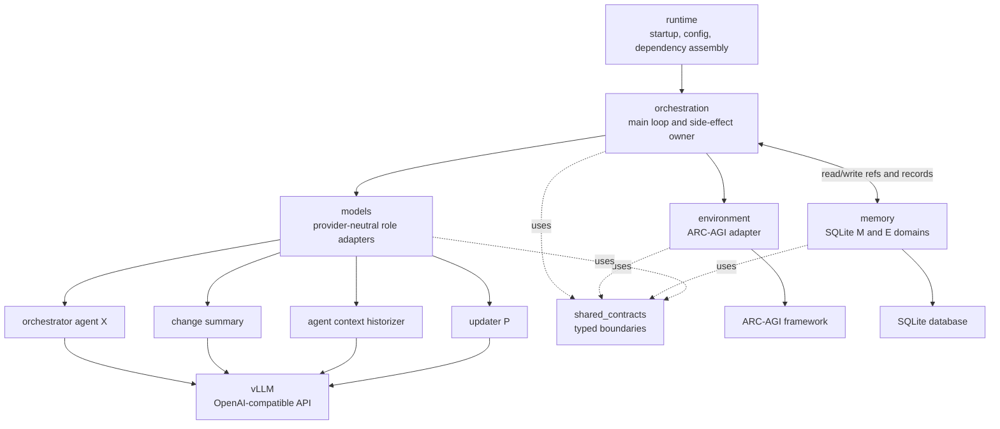
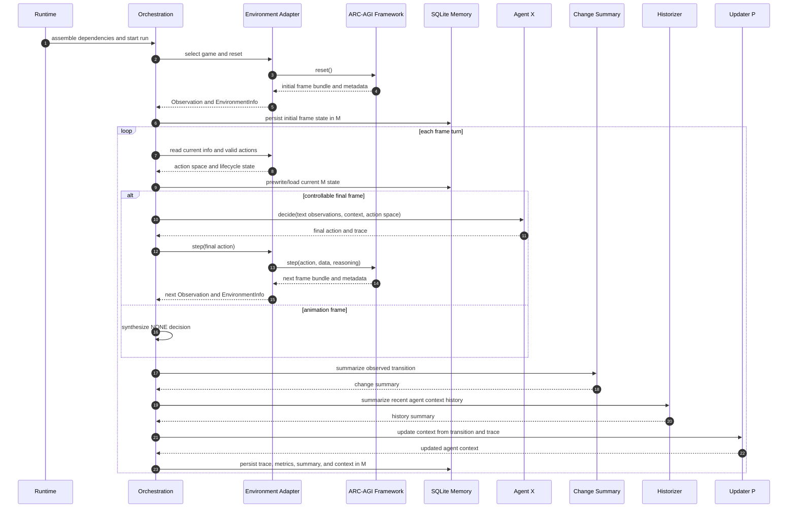

# Software Architecture Diagrams

These diagrams describe the current runtime architecture. Orchestration is the
central owner of execution, persistence, model calls, and environment
communication.

## High-Level Block Diagram

## Main Execution Loop

