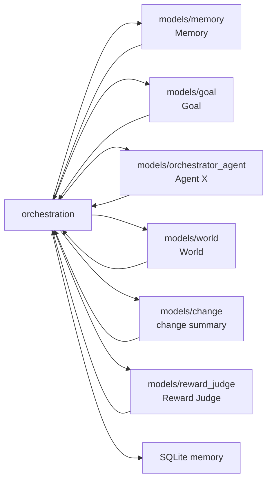

# Model Diagrams

```mermaid
flowchart LR
    Orch["orchestration"]
    X["models/orchestrator_agent\nAgent X"]
    C["models/change\nchange summary"]
    MemRole["models/memory\nMemory"]
    W["models/world\nWorld"]
    G["models/goal\nGoal"]
    J["models/reward_judge\nReward Judge"]
    DB["SQLite memory"]

    Orch --> MemRole
    MemRole --> Orch
    Orch --> G
    G --> Orch
    Orch --> X
    X --> Orch
    Orch --> W
    W --> Orch
    Orch --> C
    C --> Orch
    Orch --> J
    J --> Orch
    Orch --> DB
```
