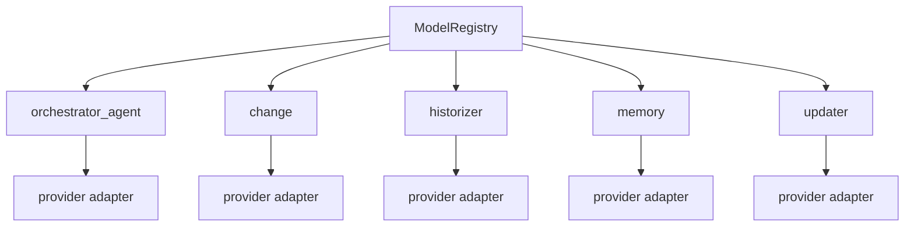

# Model Diagrams

```mermaid
flowchart TD
    Registry["ModelRegistry"]
    Registry --> X["orchestrator_agent"]
    Registry --> Change["change"]
    Registry --> Historizer["historizer"]
    Registry --> Memory["memory"]
    Registry --> Updater["updater"]

    X --> XProvider["provider adapter"]
    Change --> ChangeProvider["provider adapter"]
    Historizer --> HistorizerProvider["provider adapter"]
    Memory --> MemoryProvider["provider adapter"]
    Updater --> UpdaterProvider["provider adapter"]
```
