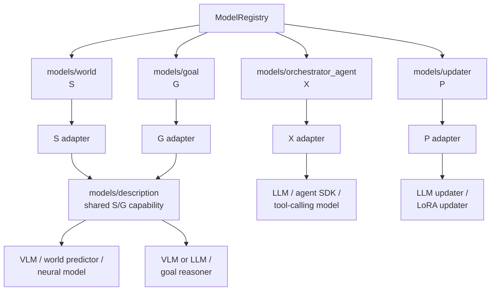
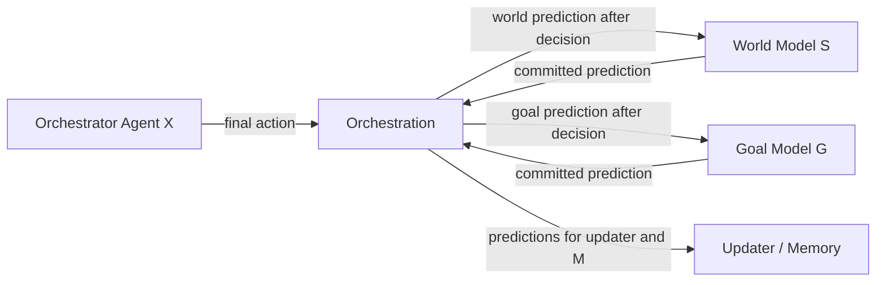

# Model Diagrams

## Role Layout

Backends are role-specific. Two roles may share a provider as an
implementation choice, but that is not an architectural dependency.

## Committed Prediction Roles

