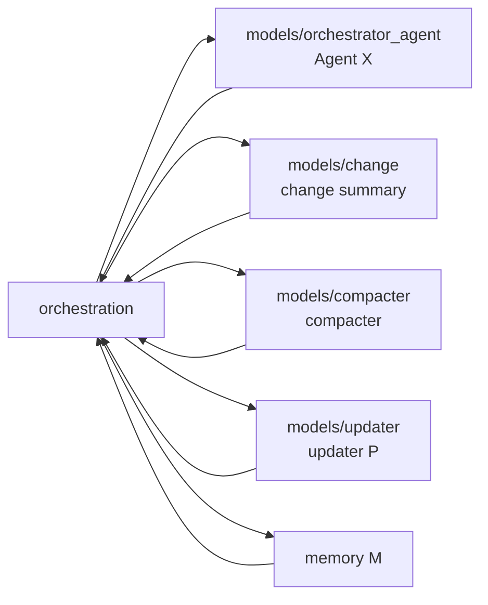

# Model Diagrams

```mermaid
flowchart LR
    Orch["orchestration"]
    X["models/orchestrator_agent\nAgent X"]
    C["models/change\nchange summary"]
    K["models/compacter\ncompacter"]
    P["models/updater\nupdater P"]
    M["memory M"]

    Orch --> X
    X --> Orch
    Orch --> C
    C --> Orch
    M --> Orch
    Orch --> K
    K --> Orch
    Orch --> P
    P --> Orch
    Orch --> M
```
