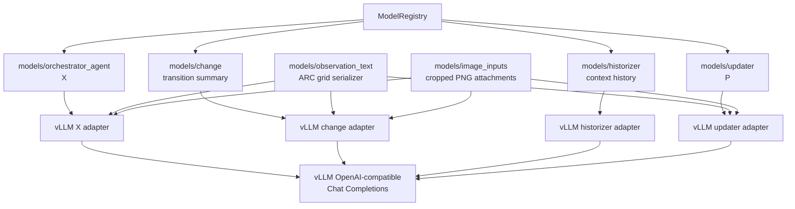
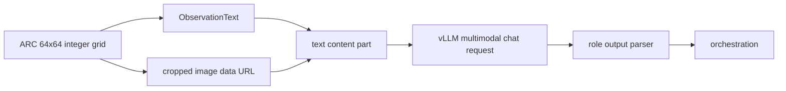

# Model Diagrams

## Role Layout

```mermaid
flowchart TB
    Registry["ModelRegistry"]

    X["models/orchestrator_agent\nX"]
    Change["models/change\ntransition summary"]
    Historizer["models/historizer\ncontext history"]
    P["models/updater\nP"]
    Text["models/observation_text\nARC grid serializer"]
    Images["models/image_inputs\ncropped PNG attachments"]

    XAdapter["vLLM X adapter"]
    ChangeAdapter["vLLM change adapter"]
    HAdapter["vLLM historizer adapter"]
    PAdapter["vLLM updater adapter"]
    VLLM["vLLM OpenAI-compatible\nChat Completions"]

    Registry --> X --> XAdapter --> VLLM
    Registry --> Change --> ChangeAdapter --> VLLM
    Registry --> Historizer --> HAdapter --> VLLM
    Registry --> P --> PAdapter --> VLLM
    Text --> XAdapter
    Text --> ChangeAdapter
    Text --> PAdapter
    Images --> XAdapter
    Images --> ChangeAdapter
    Images --> PAdapter
```

The role contracts remain provider-neutral. The only real backend implementation
is vLLM.

## Frame-Consuming Request Flow

```mermaid
flowchart LR
    Obs["ARC 64x64 integer grid"] --> Text["ObservationText"]
    Obs --> Images["cropped image data URL"]
    Text --> Prompt["text content part"]
    Images --> Prompt
    Prompt --> VLLM["vLLM multimodal chat request"]
    VLLM --> Parser["role output parser"]
    Parser --> Orch["orchestration"]
```
