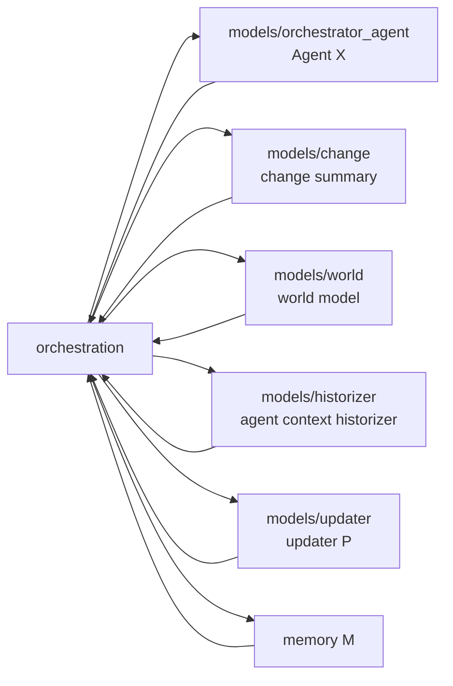

# Model Diagrams

```mermaid
flowchart LR
    Orch["orchestration"]
    X["models/orchestrator_agent\nAgent X"]
    C["models/change\nchange summary"]
    W["models/world\nworld model"]
    H["models/historizer\nagent context historizer"]
    P["models/updater\nupdater P"]
    M["memory M"]

    Orch --> X
    X --> Orch
    Orch --> C
    C --> Orch
    M --> Orch
    Orch --> W
    W --> Orch
    Orch --> H
    H --> Orch
    Orch --> P
    P --> Orch
    Orch --> M
```
