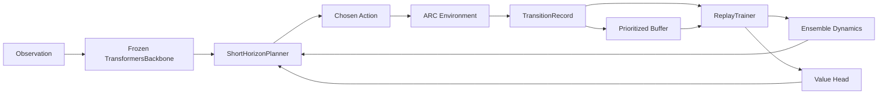

# Online Diagrams

```mermaid
flowchart LR
    Obs[Observation] --> B[Frozen TransformersBackbone]
    B --> P[ShortHorizonPlanner]
    P --> Act[Chosen Action]
    Act --> Env[ARC Environment]
    Env --> Tr[TransitionRecord]
    Tr --> Buf[Prioritized Buffer]
    Tr --> R[ReplayTrainer]
    Buf --> R
    R --> W[Ensemble Dynamics]
    R --> V[Value Head]
    W --> P
    V --> P
```
