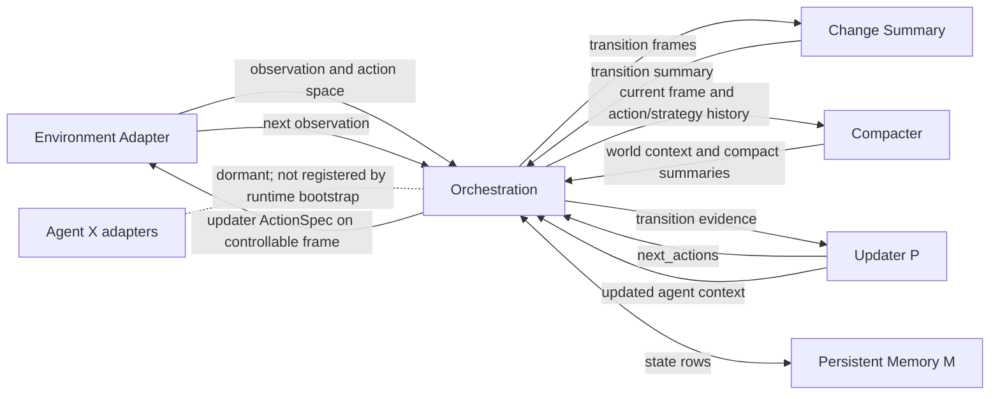

# Orchestration Diagrams

```mermaid
flowchart LR
    Env["Environment Adapter"] -->|observation and action space| Orch["Orchestration"]
    P["Updater P"] -->|next_actions| Orch
    Orch -->|updater ActionSpec on controllable frame| Env
    Env -->|next observation| Orch
    Orch -->|transition frames| C["Change Summary"]
    C -->|transition summary| Orch
    Orch -->|current frame and action/strategy history| K["Compacter"]
    K -->|world context and compact summaries| Orch
    Orch -->|transition evidence| P["Updater P"]
    P -->|updated agent context| Orch
    Orch <-->|state rows| M["Persistent Memory M"]
    X["Agent X adapters"] -. dormant; not registered by runtime bootstrap .- Orch
```
