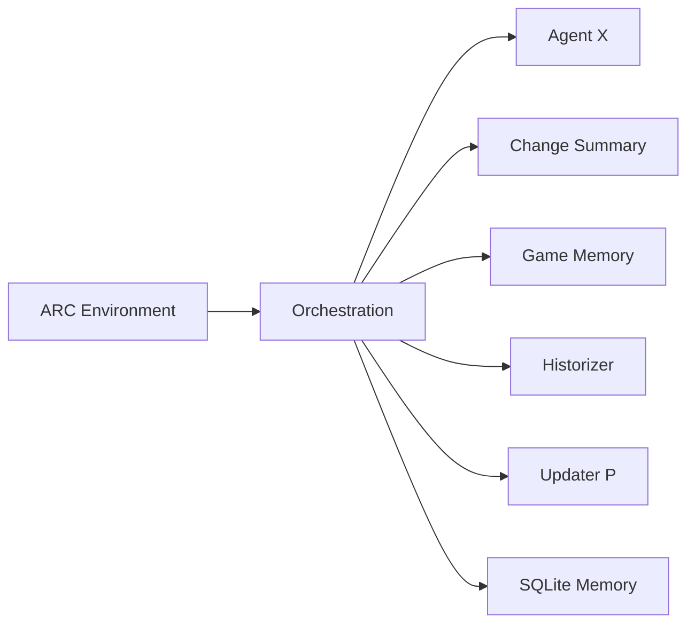

# Orchestration Diagrams

```mermaid
flowchart LR
    Env["ARC Environment"] --> Orch["Orchestration"]
    Orch --> X["Agent X"]
    Orch --> Change["Change Summary"]
    Orch --> Memory["Game Memory"]
    Orch --> Hist["Historizer"]
    Orch --> Updater["Updater P"]
    Orch --> DB["SQLite Memory"]
```
