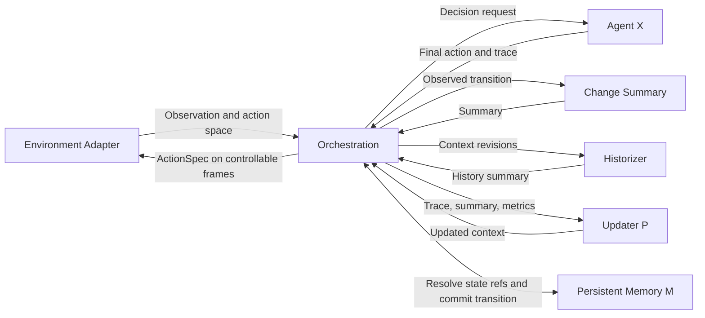
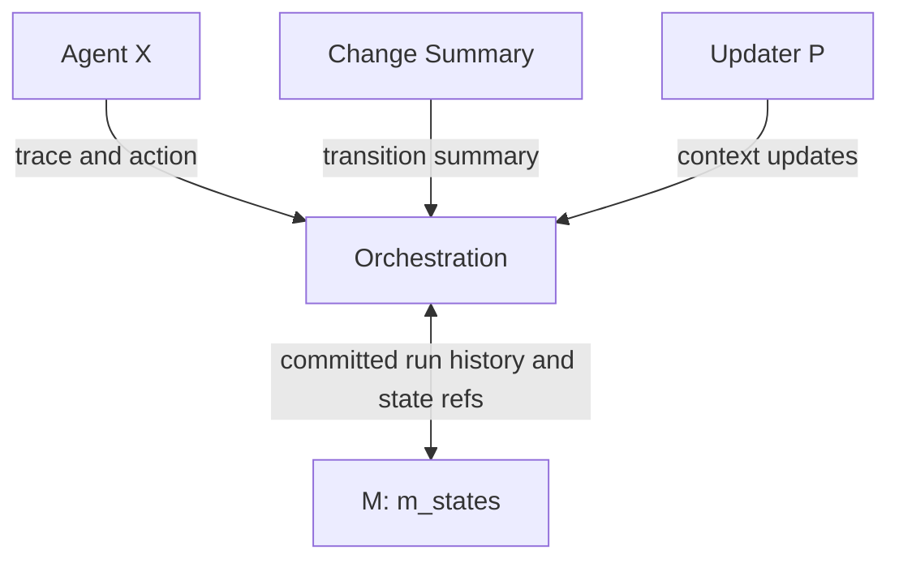

# Orchestration Diagrams

## Ownership Around One Frame Turn

```mermaid
flowchart LR
    Env["Environment Adapter"] -->|Observation and action space| Orch["Orchestration"]
    Orch -->|Decision request| X["Agent X"]
    X -->|Final action and trace| Orch
    Orch -->|ActionSpec on controllable frames| Env
    Orch -->|Observed transition| Change["Change Summary"]
    Change -->|Summary| Orch
    Orch -->|Context revisions| Hist["Historizer"]
    Hist -->|History summary| Orch
    Orch -->|Trace, summary, metrics| P["Updater P"]
    P -->|Updated context| Orch
    Orch <-->|Resolve state refs and commit transition| M["Persistent Memory M"]
```

## Persistence Gate

```mermaid
flowchart TB
    X["Agent X"] -->|trace and action| Orch["Orchestration"]
    Change["Change Summary"] -->|transition summary| Orch
    P["Updater P"] -->|context updates| Orch
    Orch <-->|committed run history and state refs| M["M: m_states"]
```
