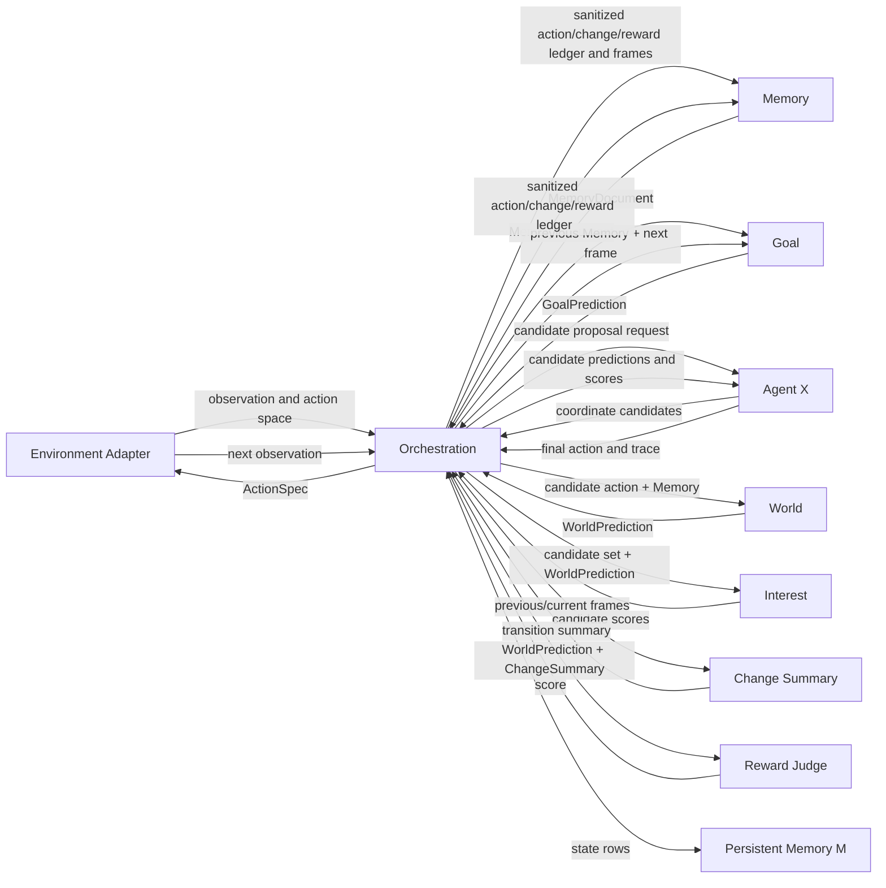

# Orchestration Diagrams

```mermaid
flowchart LR
    Env["Environment Adapter"] -->|observation and action space| Orch["Orchestration"]
    Orch -->|sanitized action/change/reward ledger and frames| MemRole["Memory"]
    MemRole -->|MemoryDocument| Orch
    Orch -->|MemoryDocument| G["Goal"]
    G -->|GoalPrediction| Orch
    Orch -->|candidate proposal request| X["Agent X"]
    X -->|coordinate candidates| Orch
    Orch -->|candidate action + Memory| W["World"]
    W -->|WorldPrediction| Orch
    Orch -->|candidate set + WorldPrediction| I["Interest"]
    I -->|candidate scores| Orch
    Orch -->|candidate predictions and scores| X
    X -->|final action and trace| Orch
    Orch -->|ActionSpec| Env
    Env -->|next observation| Orch
    Orch -->|previous/current frames| C["Change Summary"]
    C -->|transition summary| Orch
    Orch -->|WorldPrediction + ChangeSummary| J["Reward Judge"]
    J -->|score| Orch
    Orch -->|previous Memory + next frame| G
    Orch -->|sanitized action/change/reward ledger| MemRole
    Orch <-->|state rows| M["Persistent Memory M"]
```
