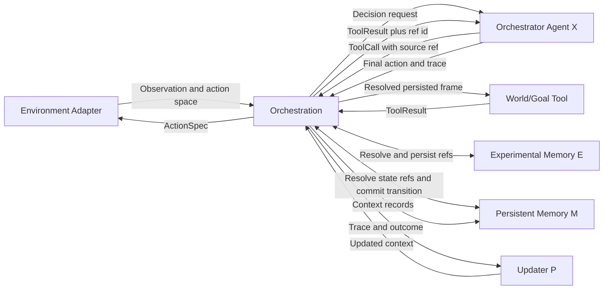
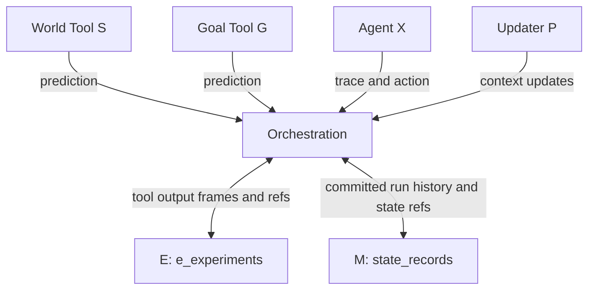

# Orchestration Diagrams

## Ownership Around One Step

```mermaid
flowchart LR
    Env["Environment Adapter"] -->|Observation and action space| Orch["Orchestration"]
    Orch -->|Decision request| X["Orchestrator Agent X"]
    X -->|ToolCall with source ref| Orch
    Orch -->|Resolved persisted frame| Tool["World/Goal Tool"]
    Tool -->|ToolResult| Orch
    Orch <-->|Resolve and persist refs| E["Experimental Memory E"]
    Orch -->|ToolResult plus ref id| X
    X -->|Final action and trace| Orch
    Orch -->|ActionSpec| Env
    Orch <-->|Resolve state refs and commit transition| M["Persistent Memory M"]
    Orch -->|Trace and outcome| P["Updater P"]
    P -->|Updated context| Orch
    Orch -->|Context records| M
```

## Persistence Gate

```mermaid
flowchart TB
    S["World Tool S"] -->|prediction| Orch["Orchestration"]
    G["Goal Tool G"] -->|prediction| Orch
    X["Agent X"] -->|trace and action| Orch
    P["Updater P"] -->|context updates| Orch
    Orch <-->|tool output frames and refs| E["E: e_experiments"]
    Orch <-->|committed run history and state refs| M["M: state_records"]
```
