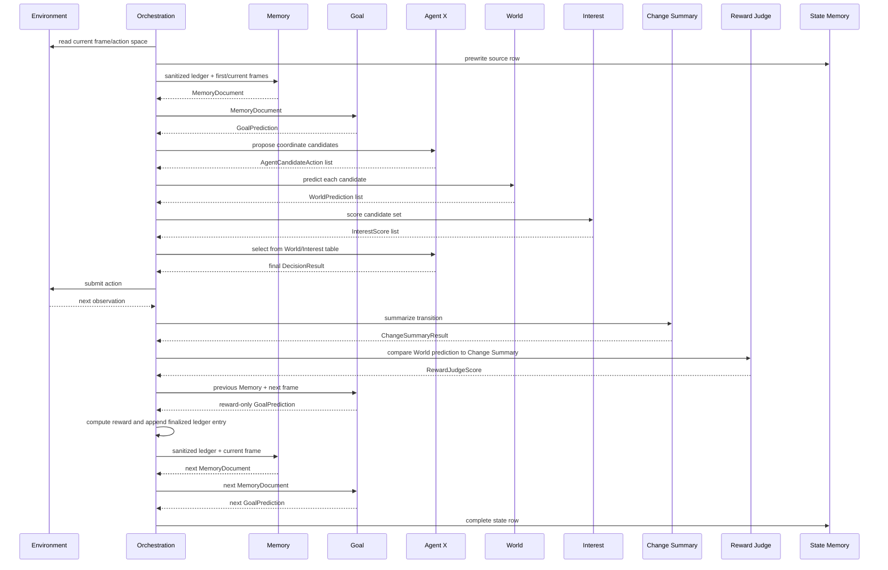

# Game Loop Diagrams

```mermaid
sequenceDiagram
    participant Env as Environment
    participant Orch as Orchestration
    participant MemRole as Memory
    participant G as Goal
    participant X as Agent X
    participant W as World
    participant I as Interest
    participant C as Change Summary
    participant J as Reward Judge
    participant M as State Memory

    Orch->>Env: read current frame/action space
    Orch->>M: prewrite source row
    Orch->>MemRole: sanitized ledger + first/current frames
    MemRole-->>Orch: MemoryDocument
    Orch->>G: MemoryDocument
    G-->>Orch: GoalPrediction
    Orch->>X: propose coordinate candidates
    X-->>Orch: AgentCandidateAction list
    Orch->>W: predict each candidate
    W-->>Orch: WorldPrediction list
    Orch->>I: score candidate set
    I-->>Orch: InterestScore list
    Orch->>X: select from World/Interest table
    X-->>Orch: final DecisionResult
    Orch->>Env: submit action
    Env-->>Orch: next observation
    Orch->>C: summarize transition
    C-->>Orch: ChangeSummaryResult
    Orch->>J: compare World prediction to Change Summary
    J-->>Orch: RewardJudgeScore
    Orch->>G: previous Memory + next frame
    G-->>Orch: reward-only GoalPrediction
    Orch->>Orch: compute reward and append finalized ledger entry
    Orch->>MemRole: sanitized ledger + current frame
    MemRole-->>Orch: next MemoryDocument
    Orch->>G: next MemoryDocument
    G-->>Orch: next GoalPrediction
    Orch->>M: complete state row
```
