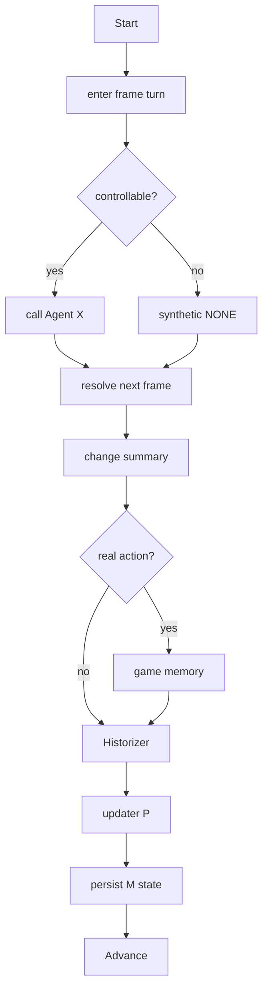

# Game Loop Diagrams

```mermaid
flowchart TD
    Start --> Frame["enter frame turn"]
    Frame --> Decision{"controllable?"}
    Decision -- yes --> X["call Agent X"]
    Decision -- no --> None["synthetic NONE"]
    X --> Next["resolve next frame"]
    None --> Next
    Next --> Change["change summary"]
    Change --> Memory{"real action?"}
    Memory -- yes --> GameMemory["game memory"]
    Memory -- no --> Historizer
    GameMemory --> Historizer
    Historizer --> Updater["updater P"]
    Updater --> Persist["persist M state"]
    Persist --> Advance
```
