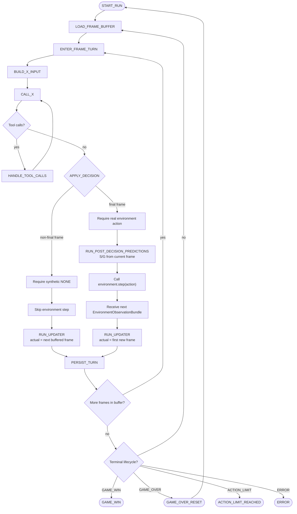
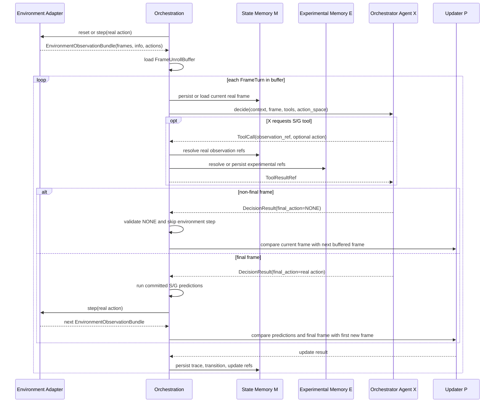

# Game Loop Diagrams

## State-Machine Block Diagram

```mermaid
flowchart TD
    Start([START_RUN]) --> Load[LOAD_FRAME_BUFFER]
    Load --> Enter[ENTER_FRAME_TURN]
    Enter --> Build[BUILD_X_INPUT]
    Build --> CallX[CALL_X]
    CallX --> Tools{Tool calls?}

    Tools -- yes --> Route[HANDLE_TOOL_CALLS]
    Route --> CallX
    Tools -- no --> Apply{APPLY_DECISION}

    Apply -- non-final frame --> ValidateNone[Require synthetic NONE]
    ValidateNone --> SkipEnv[Skip environment step]
    SkipEnv --> UpdateBuffered["RUN_UPDATER<br/>actual = next buffered frame"]

    Apply -- final frame --> ValidateReal[Require real environment action]
    ValidateReal --> Predict["RUN_POST_DECISION_PREDICTIONS<br/>S/G from current frame"]
    Predict --> StepEnv["Call environment.step(action)"]
    StepEnv --> NewBundle[Receive next EnvironmentObservationBundle]
    NewBundle --> UpdateFresh["RUN_UPDATER<br/>actual = first new frame"]

    UpdateBuffered --> Persist[PERSIST_TURN]
    UpdateFresh --> Persist
    Persist --> MoreFrames{More frames in buffer?}

    MoreFrames -- yes --> Enter
    MoreFrames -- no --> Lifecycle{Terminal lifecycle?}
    Lifecycle -- no --> Load
    Lifecycle -- GAME_WIN --> Win([GAME_WIN])
    Lifecycle -- GAME_OVER --> Reset([GAME_OVER_RESET])
    Lifecycle -- ACTION_LIMIT --> Limit([ACTION_LIMIT_REACHED])
    Lifecycle -- ERROR --> Error([ERROR])
    Reset --> Start
```

## Sequence Diagram

```mermaid
sequenceDiagram
    participant Env as Environment Adapter
    participant Orch as Orchestration
    participant M as State Memory M
    participant E as Experimental Memory E
    participant X as Orchestrator Agent X
    participant P as Updater P

    Orch->>Env: reset or step(real action)
    Env-->>Orch: EnvironmentObservationBundle(frames, info, actions)
    Orch->>Orch: load FrameUnrollBuffer

    loop each FrameTurn in buffer
        Orch->>M: persist or load current real frame
        Orch->>X: decide(context, frame, tools, action_space)

        opt X requests S/G tool
            X-->>Orch: ToolCall(observation_ref, optional action)
            Orch->>M: resolve real observation refs
            Orch->>E: resolve or persist experimental refs
            Orch-->>X: ToolResultRef
        end

        alt non-final frame
            X-->>Orch: DecisionResult(final_action=NONE)
            Orch->>Orch: validate NONE and skip environment step
            Orch->>P: compare current frame with next buffered frame
        else final frame
            X-->>Orch: DecisionResult(final_action=real action)
            Orch->>Orch: run committed S/G predictions
            Orch->>Env: step(real action)
            Env-->>Orch: next EnvironmentObservationBundle
            Orch->>P: compare predictions and final frame with first new frame
        end

        P-->>Orch: update result
        Orch->>M: persist trace, transition, update refs
    end
```
