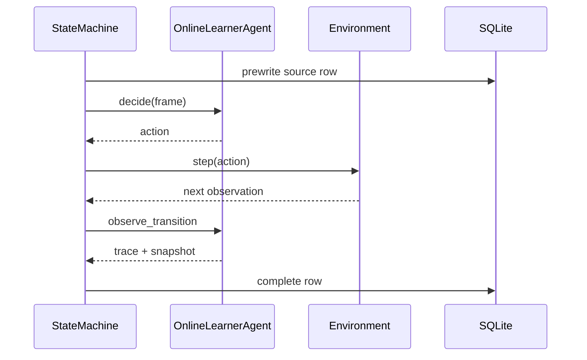

# Game Loop Diagrams

```mermaid
sequenceDiagram
    participant SM as StateMachine
    participant A as OnlineLearnerAgent
    participant E as Environment
    participant M as SQLite

    SM->>M: prewrite source row
    SM->>A: decide(frame)
    A-->>SM: action
    SM->>E: step(action)
    E-->>SM: next observation
    SM->>A: observe_transition
    A-->>SM: trace + snapshot
    SM->>M: complete row
```
