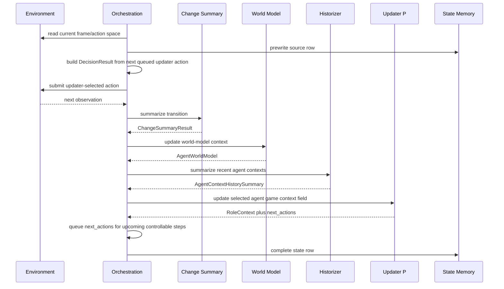

# Game Loop Diagrams

```mermaid
sequenceDiagram
    participant Env as Environment
    participant Orch as Orchestration
    participant C as Change Summary
    participant W as World Model
    participant H as Historizer
    participant P as Updater P
    participant M as State Memory

    Orch->>Env: read current frame/action space
    Orch->>M: prewrite source row
    Orch->>Orch: build DecisionResult from next queued updater action
    Orch->>Env: submit updater-selected action
    Env-->>Orch: next observation
    Orch->>C: summarize transition
    C-->>Orch: ChangeSummaryResult
    Orch->>W: update world-model context
    W-->>Orch: AgentWorldModel
    Orch->>H: summarize recent agent contexts
    H-->>Orch: AgentContextHistorySummary
    Orch->>P: update selected agent game context field
    P-->>Orch: RoleContext plus next_actions
    Orch->>Orch: queue next_actions for upcoming controllable steps
    Orch->>M: complete state row
```
